# Architecture

This document describes how the PostgreSQL PaaS is put together: the layers,
the request path, authentication, per-user instance isolation, and
observability.

The code lives in week-sized directories. Together they are one product.

| Layer | Directory | Responsibility |
| --- | --- | --- |
| Infrastructure | `week2-ske-paas/01-ske-infrastructure` | STACKIT Kubernetes Engine cluster |
| Platform | `week2-ske-paas/02-operator` | CloudNativePG operator |
| Product (sample) | `week2-ske-paas/03-product` | A first `Cluster` custom resource |
| Control plane | `week3-paas-api` | Go REST API: accounts, JWT, instance lifecycle |
| Console | `week4-web-ui` | Vue dashboard for register, login and instances |
| Observability | `week5-observability` | Prometheus, Grafana, Loki, Alloy |

Public hostname: `https://gaurav-paas.runs.onstackit.cloud`.

---

## 1. System overview

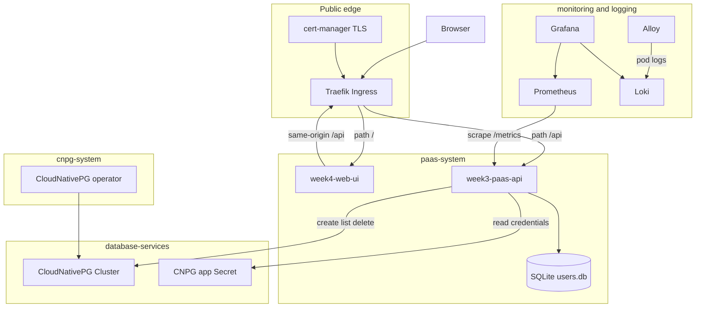

Namespaces keep the control plane, the databases and the operators apart.

| Namespace | What runs there |
| --- | --- |
| `paas-system` | Go API, Vue UI, Ingress, API ServiceAccount |
| `database-services` | CloudNativePG `Cluster` resources and their Secrets |
| `cnpg-system` | CloudNativePG operator |
| `monitoring` | kube-prometheus-stack (Prometheus, Grafana) |
| `logging` | Loki and Alloy |

The API never talks to PostgreSQL itself. It creates a `Cluster` custom
resource; the operator turns that into pods, volumes, services and a
credentials Secret. The API later reads that Secret for the connection
endpoint.

---

## 2. Request path

The UI never hardcodes the API host. It calls relative paths such as
`/api/v1/login`.

**Local development.** Vite proxies `/api` to `http://localhost:8080`. CORS
is unused because the browser sees one origin (`localhost:5173`).

**Production.** Traefik terminates TLS (Let's Encrypt via cert-manager) and
splits the host by path:

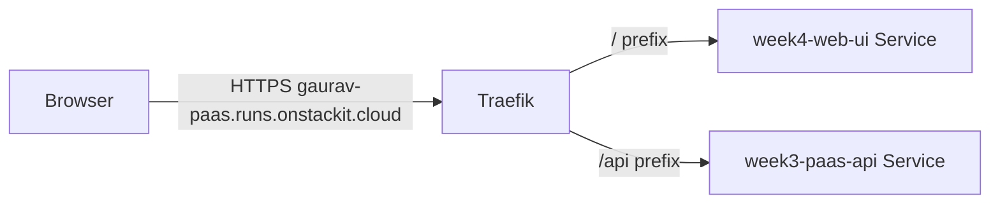

Rules live in `week4-web-ui/k8s/paas-ingress.yaml`.

---

## 3. API process

`cmd/api/main.go` starts one HTTP server.

1. Refuse to boot unless `ADMIN_USERNAME`, `ADMIN_PASSWORD` and `JWT_SECRET`
   are set.
2. Connect to Kubernetes (`PAAS_NAMESPACE`, default `database-services`).
   Inside the cluster this uses the Pod ServiceAccount. Locally it uses
   kubeconfig.
3. Open the SQLite user store (`USER_DB_PATH`, default `./users.db`).
4. Build the Gin router and listen on `PORT` (default `8080`).

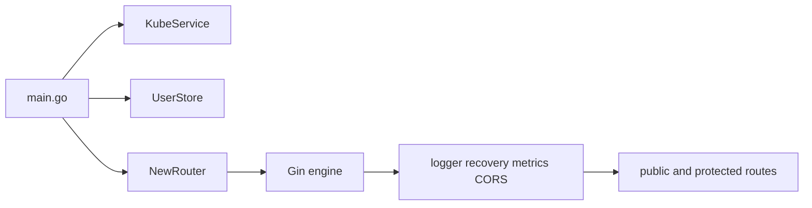

On every request the middleware stack runs first: Gin logger, panic recovery,
Prometheus metrics, then CORS. Authentication is applied only to the
`/api/v1` group that owns instances.

---

## 4. Accounts: register and login

There are two kinds of caller.

| Kind | Stored in | JWT `role` | Instance view |
| --- | --- | --- | --- |
| Environment admin | `ADMIN_USERNAME` / `ADMIN_PASSWORD` | `admin` | Every managed instance |
| Registered user | SQLite `users` table | `user` | Only instances labelled with their username |

Passwords in SQLite are bcrypt hashes. The admin password stays in the
environment and is never written to the database. The admin username cannot
be registered.

### Register

`POST /api/v1/register` is public.

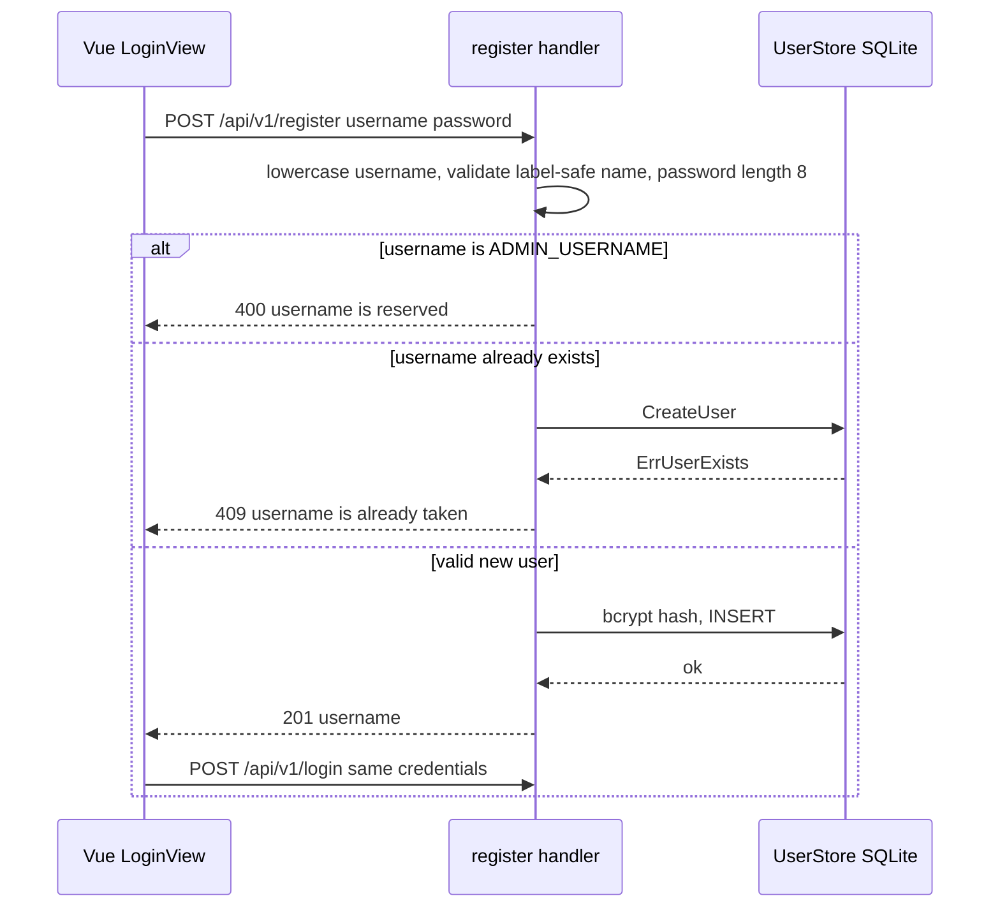

Username rules exist because the value is copied onto a Kubernetes label:
`^[a-z0-9]([a-z0-9-]{1,30}[a-z0-9])?$` (3–32 characters).

### Login

`POST /api/v1/login` is public. It returns `{ "token": "<JWT>" }`. The token
is HS256, signed with `JWT_SECRET`, valid for one hour, and carries `sub`
(username) and `role` (`admin` or `user`).

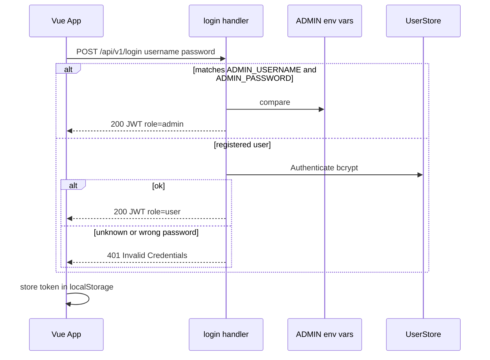

The UI reads `sub` and `role` from the JWT payload to show the signed-in
name and an admin badge. A `401` from any later call clears the token and
returns to the login screen.

---

## 5. Protecting instance routes

Every `/api/v1/instances*` route runs `Authenticate` first.

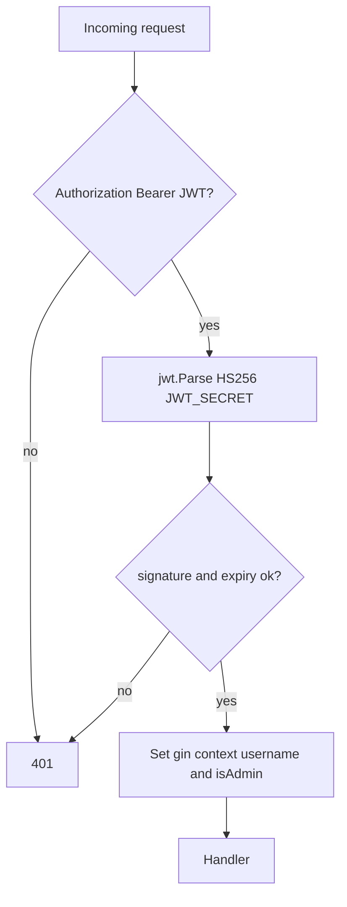

`ownerScope` then decides the Kubernetes filter:

- `role == admin` → empty string → no owner filter
- otherwise → the JWT `sub` → only that user's clusters

A user token with an empty `sub` is rejected so it cannot fall through to
the unscoped admin view.

---

## 6. Instance lifecycle

Instance names are globally unique in `database-services`. Two users cannot
both create `mydb`; the second create returns `409 Conflict`.

Every API-managed cluster carries:

| Label | Value |
| --- | --- |
| `platform.level3.io/managed-by` | `week3-paas-api` |
| `platform.level3.io/owner` | the creating username (omitted if an admin creates it) |

`Owner` in the JSON body is the PostgreSQL role that owns the database, not
the platform user. The platform user is `ownedBy` on the response.

### Create

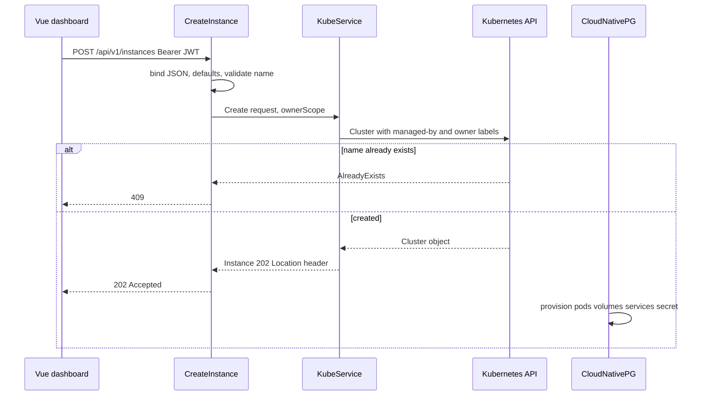

Provisioning is asynchronous. The UI polls `GET /api/v1/instances` every ten
seconds until CloudNativePG reports a healthy phase.

### List

A non-admin list uses the label selector

`platform.level3.io/managed-by=week3-paas-api,platform.level3.io/owner=<username>`

An admin list uses only `managed-by`, so every API-created cluster appears,
including ones with no owner label.

### Delete and connection

Both first call `getManagedCluster`. That helper returns Kubernetes
`NotFound` (mapped to HTTP 404) when:

- the name does not exist, or
- it is not labelled `managed-by=week3-paas-api`, or
- the caller is not an admin and the `owner` label does not match

Another user's instance is therefore indistinguishable from a missing one.
The API never reveals that the name exists.

Connection data comes from the CloudNativePG Secret `<name>-app` (`host`,
`port`, `dbname`, `username`, `password`, `uri`). The response is marked
`Cache-Control: no-store`.

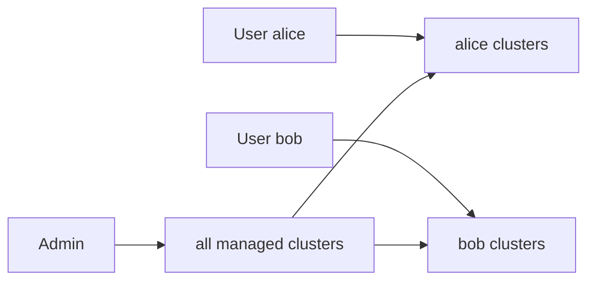

---

## 7. Frontend flow

`App.vue` is the only place that holds session state.

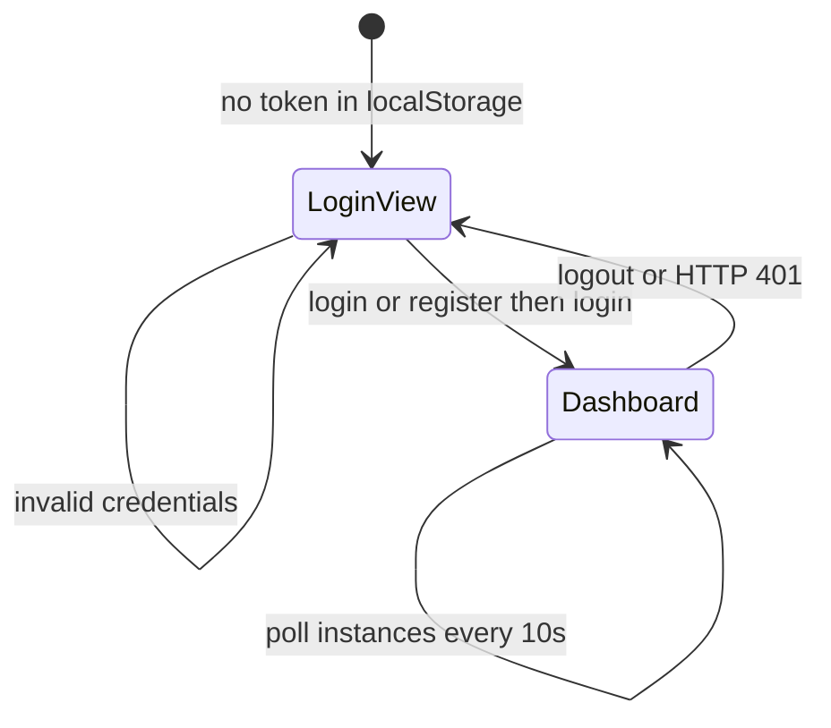

| Component | Role |
| --- | --- |
| `LoginView` | Sign-in / create-account toggle, confirm password locally |
| `AppHeader` | Signed-in name, admin badge, logout |
| `CreateInstanceForm` | Name, replica count, storage, database, PostgreSQL owner |
| `InstanceList` / `InstanceCard` | Status, replicas, `ownedBy` when present |
| `ConnectionModal` | Reveal and copy credentials |
| `ConfirmDeleteDialog` | Type-the-name guard |
| `api/client.js` | One `fetch` wrapper per REST route |

---

## 8. Observability

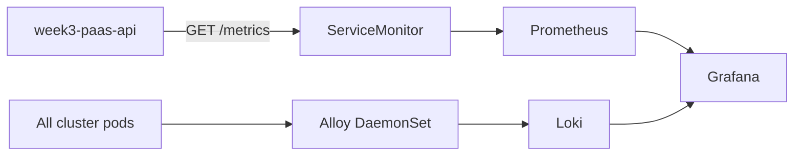

**Metrics.** `metricsMiddleware` records `total_http_requests` (method, path,
status) and `http_request_duration_seconds` (method, path) for every request
except `/metrics` itself. Prometheus scrapes the API Service every 30 seconds
through `week5-observability/monitoring/api-servicemonitor.yaml`.

**Logs.** The API writes JSON to stdout (`slog`). Alloy collects pod logs via
the Kubernetes API (no privileged host path) and pushes them to Loki. Grafana
reads both Prometheus and Loki.

Health is a separate public probe: `GET /healthz` returns
`{ "status": "ok", "service": "week3-paas-api" }` and is what Kubernetes
uses for liveness and readiness.

---

## 9. Data and identity

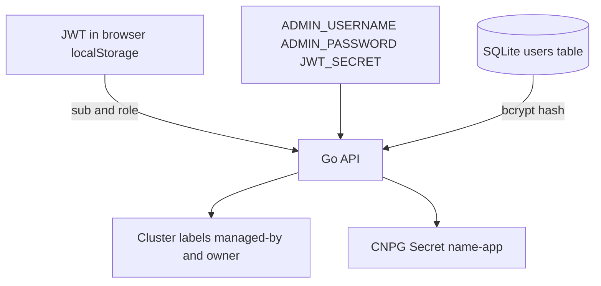

| Store | Contents | Lifetime |
| --- | --- | --- |
| SQLite `/data/users.db` on a PVC | username, password hash, created_at | Survives Pod restarts |
| Kubernetes Cluster object | spec plus owner label | Until deleted |
| Kubernetes Secret `<name>-app` | generated DB credentials | Owned by CloudNativePG |
| JWT in `localStorage` | `sub`, `role`, `exp` | One hour |

SQLite is mounted at `/data` because the API container uses a read-only root
filesystem. The Deployment uses `strategy: Recreate` and `replicas: 1`
because the volume is `ReadWriteOnce`.

The API ServiceAccount in `paas-system` is bound to a Role in
`database-services` that may only `get/list/create/delete` CloudNativePG
clusters and `get` Secrets. It cannot touch other namespaces.

---

## 10. REST surface

Public (no token):

| Method | Path | Result |
| --- | --- | --- |
| `GET` | `/healthz` | Process is up |
| `GET` | `/metrics` | Prometheus text |
| `POST` | `/api/v1/register` | `201 { username }` |
| `POST` | `/api/v1/login` | `200 { token }` |

Protected (`Authorization: Bearer <JWT>`):

| Method | Path | Result |
| --- | --- | --- |
| `POST` | `/api/v1/instances` | `202` Cluster accepted |
| `GET` | `/api/v1/instances` | `{ items, count }` scoped by owner |
| `DELETE` | `/api/v1/instances/:name` | `202` deletion accepted |
| `GET` | `/api/v1/instances/:name/connection` | credentials, `Cache-Control: no-store` |

The OpenAPI contract is `week3-paas-api/api/openapi.yaml`.

---

## 11. What this design does not do

- Instance names are not prefixed per user; uniqueness is cluster-wide.
- Isolation is a label filter, not a namespace per tenant. A user cannot
  see another user's cluster through this API, but the objects still share
  `database-services`.
- There is no refresh token, email verification, or password reset.
- SQLite is a single-replica store; it is not highly available.
- Backups, billing and multi-zone workers are out of scope for this
  prototype.
